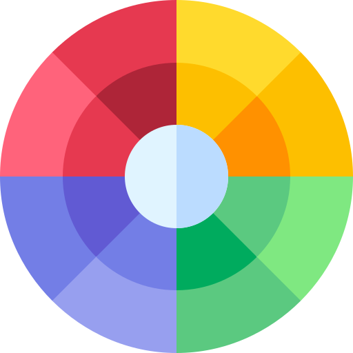

<p align="center">
  
  <h1 align="center">Chromaflow</h1>
  <div align="center">
    
    
    
  </div>
</p>
A library designed for dynamic management of CSS variables in projects written in JavaScript and TypeScript (including well-known frameworks and libraries).

### Contents:
1. [Installation](#installation)
2. [Usage](#usage)
3. [Supported methods](#supported-methods)

<h2 id="installation">1. Installation</h2>

The library has no dependencies, so installation will take a few seconds. To install, enter the following command:
```bash
npm i @diominvd/chromaflow
```

<h2 id="usage">2. Usage</h2>

The library can be used as pure JavaScript, or in conjunction with frameworks and libraries. To create a palette, you need to create an instance of the `Palette` class, since all the functionality is tied to it.
```jsx
import { Palette } from "@diominvd/chromaflow";

const MyColorPalette = new Palette({...})
```
The palette supports simple and complex colors. Simple colors have no shades. Complex colors and their shades can be set via custom values, namely the initial hue value, the final one, and the step.
```jsx
import { Palette } from "@diominvd/chromaflow";

const MyColorPalette = new Palette({
  oceanBlue: {
    color: "#2d97b8" // This color has no shades
  },
  lightGreen: {
    color: "#139654",
    isComplex: true,
    shadeConfig: { // This is color with custom shade config
      start: 100,
      end: 200,
      step: 50
    }
  },
  wildRed: {
    color: "#8a2323",
    isComplex: true // This is color with default shade config
  }
})
```
After creating the palette object, you must use the instance method to inject variables into the web page.
```jsx
MyColorPalette.injectCssVariables();
```
As a result of the creation of the palette object, the following colors will be created:
```CSS
:root {
  --oceanBlue: #2d97b8;

  --lightGreen-100: #e6fef2;
  --lightGreen-150: #139654;
  --lightGreen-200: #0c0d0d;

  --wildRed-100: #fee6e6;
  --wildRed-200: #fbafaf;
  --wildRed-300: #ee6868;
  --wildRed-400: #d92828;
  --wildRed-500: #8a2323;
  --wildRed-600: #5e2424;
  --wildRed-700: #381e1e;
  --wildRed-800: #191212;
  --wildRed-900: #0d0c0c;
}
```
As you can see, when creating the gradation for the `wildRed` color, standard values were used, since no custom values were specified.

<h2 id="supported-methods">3. Supported methods</h2>

- `getElement` - allows you to get all the color information.
```jsx
const colorData = MyColorPalette.getElement("wildRed");
```
- `addElement` - allows you to add a new color to the palette after creating the palette.
```jsx
MyColorPalette.addElement("newColorName", {
  color: "#333333",
  isComplex: true,
  shadeConfig: {
    start: 100,
    end: 500,
    step: 25
  }
});
```
- `removeElement` - allows you to remove the color of their already existing palette.
```jsx
MyColorPalette.removeElement("wildRed");
```
- `getAllElements` - allows you to get all the information about the current palette.
```jsx
console.log(MyColorPalette.getAllElements());
```
- `getShade` - allows you to get a color for a specific shade.
```jsx
const colorValue = MyColorPalette.getShade("lightGreen", 100);
```
- `injectCssVariables` - performs an "injection" of created variables onto a web page.
```jsx
MyColorPalette.injectCssVariables();
```
