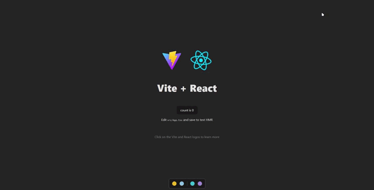

<!--Header-->
<div align="center">
  
  <h3>Chromaflow</h3>
</div>

<!--Information-->
<div align="center" >
  
  
  
</div>

<!--Description-->
<h2 id="description">Description</h2>
<p>
  Chromaflow is a lightweight library for managing CSS variables in JavaScript and TypeScript projects. It provides a convenient API for creating and managing color palettes, including support for shades and integration with React.
</p>

<p>
  For a list of changes in the project, please refer to the <a href='./CHANGELOG.md'>CHANGELOG.md</a>.
</p>

<!--Preview-->
<h2 id="preview">Preview</h2>


<!--Features-->
<h2 id="main-features">Main features</h2>
<span>
  <ul style="list-style-type: -">
    <li>🎨 Create and manage color palettes</li>
    <li>🌈 Support for simple and complex colors with shades</li>
    <li>🔄 Dynamic color updates</li>
    <li>⚛️ Ready integration with React</li>
    <li>📦 There are no external dependencies</li>
    <li>🎯 Full TypeScript support</li>
  </ul>
</span>

<!--Installation-->
<h2 id="installation">Installation</h2>

```bash
npm install @diominvd/chromaflow
```

<!--Color configuration-->
<h2 id="color-configuration">Color configuration</h2>

<!--Simple color-->
<h3 id="simple-color">Simple color</h3>

```javascript
{
  color: "#1d63b3"
}
```

<!--Complex color-->
<h3 id="complex-color">Complex color</h3>

```javascript
{
  color: "#139654",
  isComplex: true,
  shadeConfig: {
    start: 100,
    end: 200,
    step: 50
  }
}
```

<!--Quick start-->
<h2 id="quick-start">Quick start</h2>

<!--Basic usage-->
<h3 id="basic-usage">Basic usage</h3>

```javascript
import { Palette } from "@diominvd/chromaflow";

const palette = new Palette({
  primary: {
    color: "#1d63b3"
  },
  accent: {
    color: "#139654",
    isComplex: true,
    shadeConfig: {
      start: 100,
      end: 200,
      step: 50
    }
  }
});
```

<!--Use with react-->
<h3 id="use-with-react">Use with React</h3>

```jsx
import { PaletteProvider, usePalette, PaletteTools } from "@diominvd/chromaflow";

function App() {
  return (
    <PaletteProvider colors={{
      primary: { color: "#1d63b3" }
    }}>
      <YourApp />
      <Floater />
    </PaletteProvider>
  );
}

function YourComponent() {
  const { palette } = usePalette();
  const primaryColor = palette.getElement("primary");

  return (
    <div style={{ color: primaryColor.color }}>
      Hello, chromaflow!
    </div>
  );
}
```

<!--API-->
<h2 id="api">API</h2>

<!--Palette-->
<h3 id="palette">Palette</h3>
<span>
  The main class for managing the color palette. Uses composition to delegate responsibility.
</span>

<!--Internal classes-->
<h4 id="palette-components">Internal classes</h4>
<ul>
  <li><code>PaletteStorage</code> - cache management in localStorage</li>
  <li><code>PaletteStyleManager</code> - managing CSS variables</li>
  <li><code>PaletteValidator</code> - data validation</li>
</ul>

<h4 id="palette-methods">Methods</h4>
<ul>
  <li><code>addElement(name: string, config: ColorPaletteElement)</code> - adding a new color</li>
  <li><code>removeElement(name: string)</code> - removing the color</li>
  <li><code>getElement(name: string)</code> - getting color information</li>
  <li><code>getAllElements()</code> - getting the entire palette</li>
  <li><code>getShade(name: string, shade: number)</code> - getting a specific shade</li>
  <li><code>hasElement(name: string)</code> - checking for color in the palette</li>
  <li><code>clearPalette()</code> - clears the palette</li>
  <li><code>updateElements(elements: ColorPalette)</code> - updates the current palette</li>
</ul>

<!--PaletteValidator-->
<h3 id="palette-validator">PaletteValidator</h3>
<span>
  Static utility class for validating palette data.
</span>

<h4 id="palette-validator-methods">Methods</h4>
<ul>
  <li><code>isValidColor(color: string)</code> - checking the color format</li>
  <li><code>isValidShadeConfig(config: any)</code> - checking the shade configuration</li>
  <li><code>isValidElement(data: ColorPaletteElement)</code> - checking the validity of a palette element</li>
  <li><code>validateElements(elements: ColorPalette)</code> - validation of the entire palette</li>
</ul>

<!--React Integration-->
<h3 id="react-integration">React Integration</h3>

<!--PaletteProvider-->
<h4 id="palette-provider">PaletteProvider</h4>
<span>
  Contextual provider for React applications.
</span>

```jsx
import { PaletteProvider } from "@diominvd/chromaflow";

<PaletteProvider colors={colors}>
  <YourApp />
</PaletteProvider>
```

<!--usePalette-->
<h4 id="use-palette">usePalette</h4>
<span>
  A hook for accessing the palette in React components.
</span>

```jsx
import { usePalette } from "@diominvd/chromaflow";

const { palette } = usePalette();
```

<!--Floater-->
<h4 id="floater">Floater</h4>
<span>
  A component for visual palette management.
</span>

```jsx
import { Floater } from "@diominvd/chromaflow";

<Floater palette={PaletteObject} />
```

<!--Requirements-->
<h2 id="requirements">Requirements</h2>
<ul>
  <li>Node.js >= 14</li>
  <li>For React integration: React >= 16.8.0</li>
</ul>

<!--License-->
<h2 id="license">License</h2>
<span>The project is being developed under the MIT license</span>
